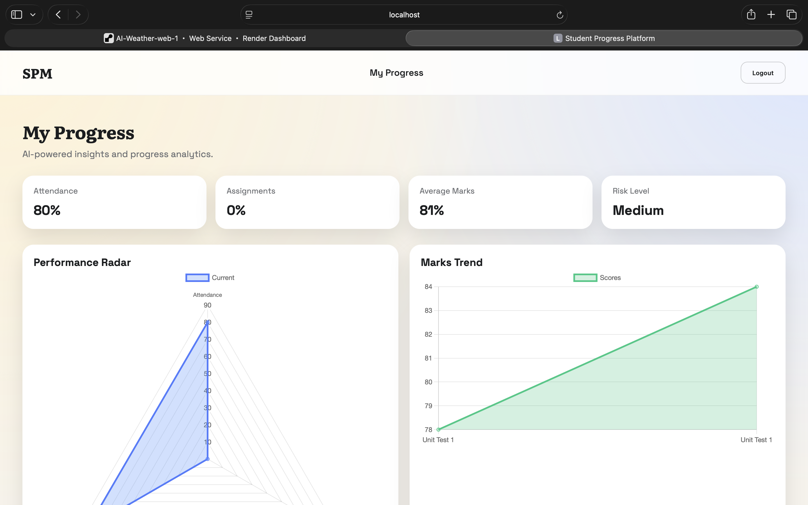
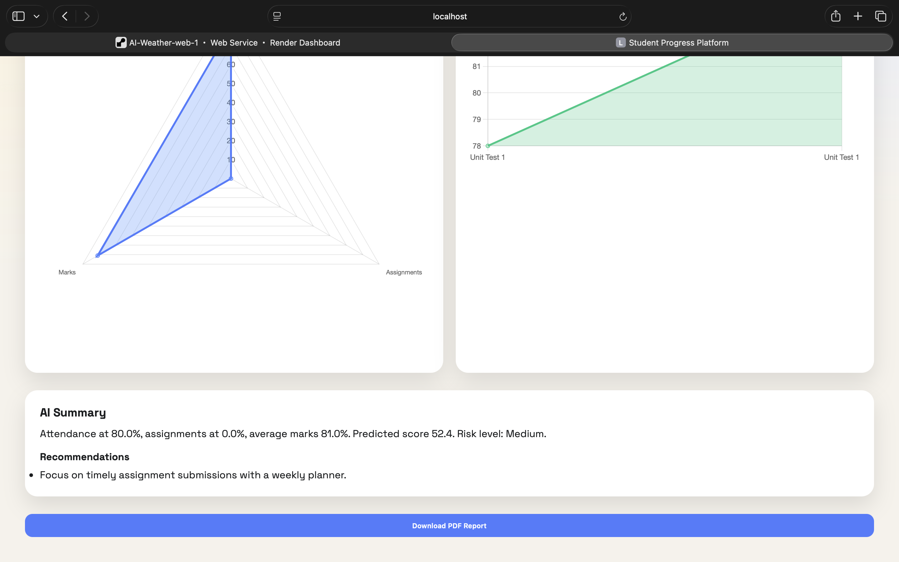
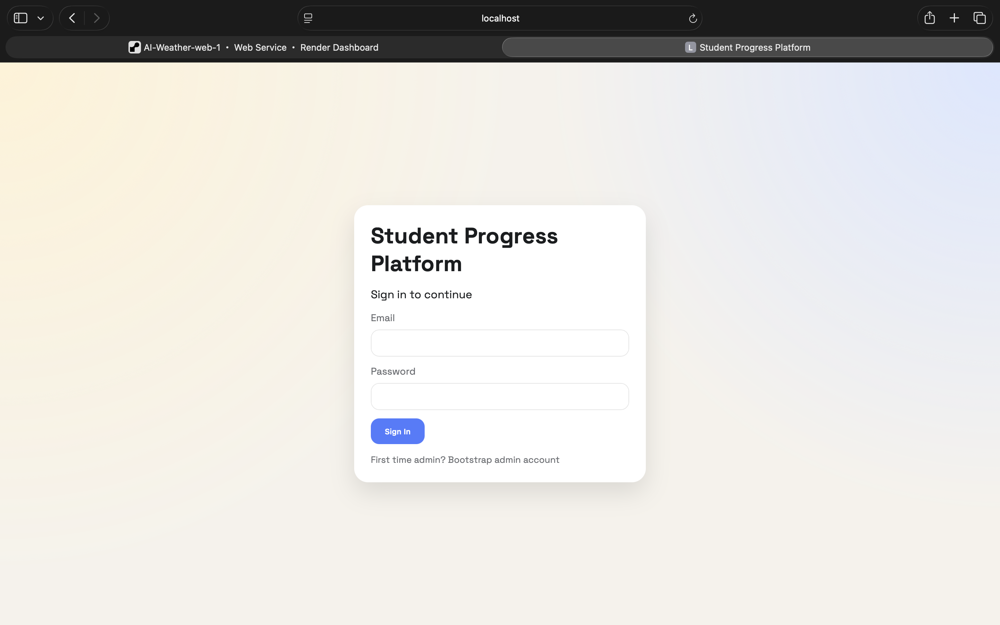
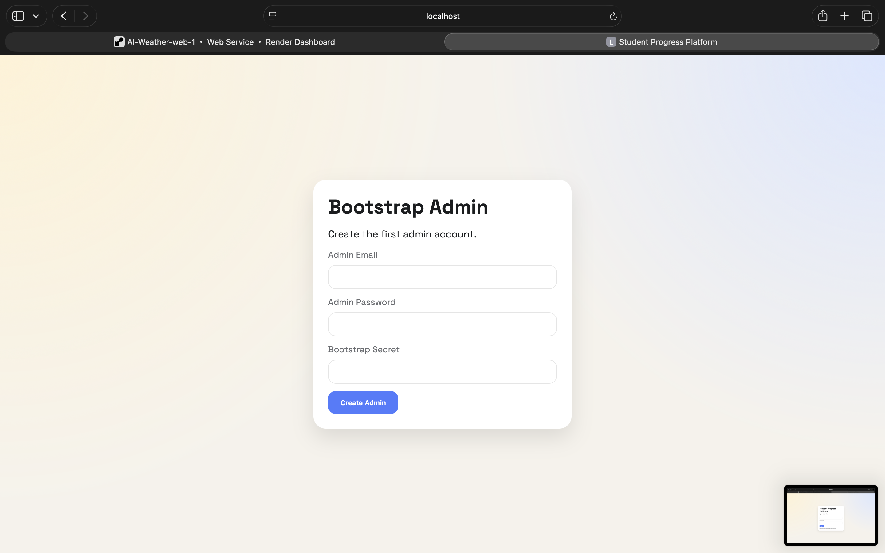
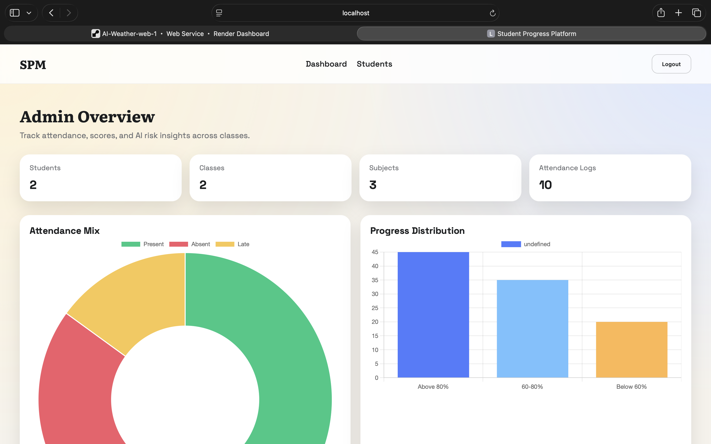
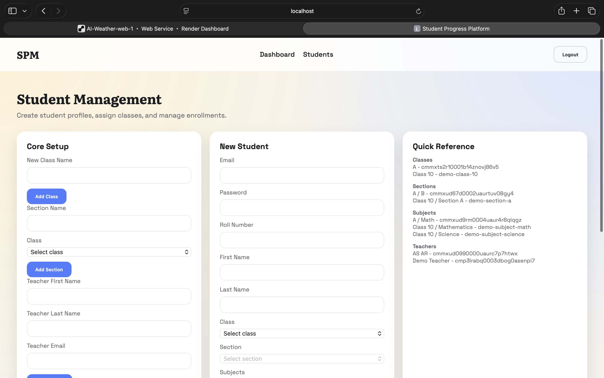
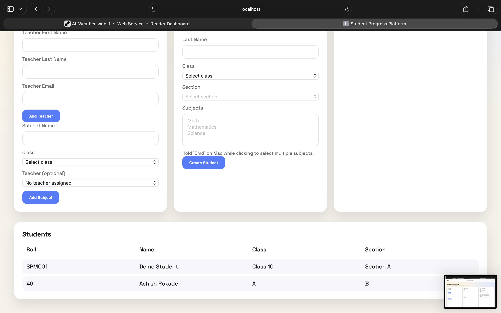
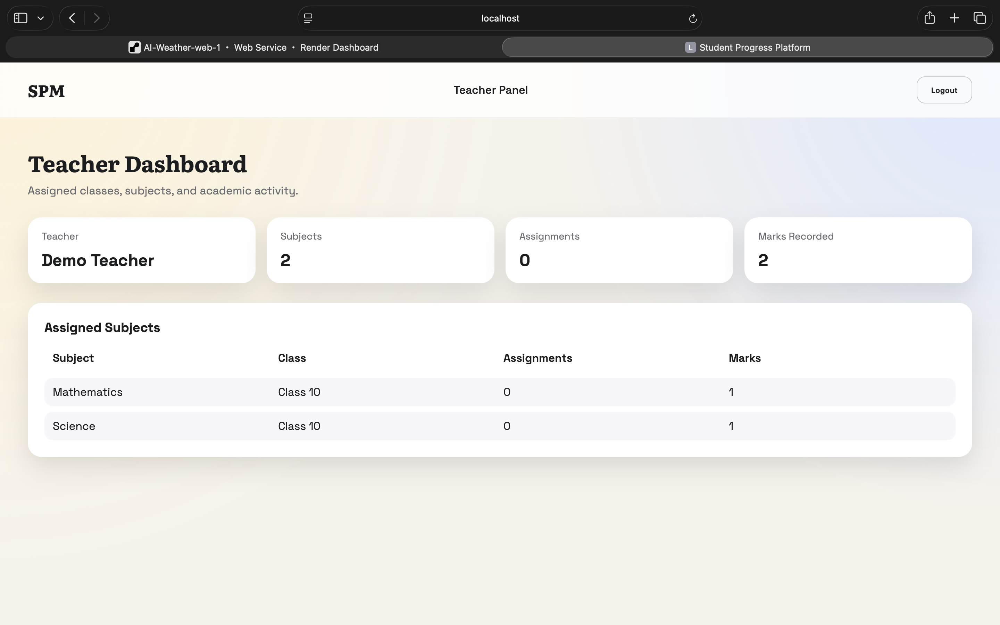

# Student Progress Management System
Live Demo: https://ai-student-progress-management.onrender.com

A full-stack student progress management app for schools and coaching institutes. It includes separate login flows for admin, teacher, and student users, plus attendance tracking, marks management, assignment data, AI-style progress analysis, dashboards, and PDF progress reports.

## Features

- Admin, teacher, and student email/password login
- Admin panel for classes, sections, teachers, subjects, and students
- Multi-class and multi-section academic structure
- Teacher dashboard for assigned classes and subjects
- Student dashboard with attendance, marks, assignment completion, AI summary, risk level, recommendations, and PDF report download
- PostgreSQL database with Prisma ORM
- Python analytics script executed from Node.js, with a JavaScript fallback
- Vercel-ready project structure

## Tech Stack

- Frontend: React, Vite, Chart.js
- Backend: Node.js, Express.js
- Database: PostgreSQL
- ORM: Prisma
- Analytics: Python script executed by Node.js
- Reports: PDFKit
- Deployment target: Vercel

## Project Structure

```text
SPMMM/
  apps/
    api/              Node.js + Express + Prisma backend
    analytics/        Python analytics script
    web/              React + Vite frontend
  packages/
  docs/
  vercel.json
  README.md
```

## Screenshots

### 1. Student Progress Dashboard

Student view showing attendance, assignment completion, average marks, risk level, performance radar, and marks trend.



### 2. Student AI Summary And PDF Report

Student view showing the AI-generated summary, recommendations, and PDF report download button.



### 3. Login Page

Main login screen for admin, teacher, and student users.



### 4. Bootstrap Admin Page

First-admin setup screen using the bootstrap secret.



### 5. Admin Dashboard

Admin overview with student, class, subject, attendance, and progress charts.



### 6. Student Management Setup

Admin student management page for creating classes, sections, teachers, subjects, and students.



### 7. Student Management List

Admin student management page showing subject setup, student creation, and saved students.



### 8. Teacher Dashboard

Teacher panel showing assigned subjects, class mapping, assignment count, and marks count.



## Prerequisites

Install these before running the project:

- Node.js 18 or newer
- npm
- PostgreSQL 15
- Python 3

On macOS with Homebrew, PostgreSQL can be installed and started with:

```bash
brew install postgresql@15
brew services start postgresql@15
```

## Environment Setup

From the project root:

```bash
cd /Users/ashu/Documents/task/SPMMM
npm install
```

Create environment files:

```bash
cp apps/api/.env.example apps/api/.env
cp apps/web/.env.example apps/web/.env
```

Use this local database URL in `apps/api/.env`:

```env
DATABASE_URL=postgresql://ashu@localhost:5432/student_progress?schema=public
JWT_SECRET=supersecret
ADMIN_BOOTSTRAP_SECRET=bootsecret
CORS_ORIGIN=http://localhost:5173
PORT=4000
```

Use this frontend API URL in `apps/web/.env`:

```env
VITE_API_URL=http://localhost:4000
```

## Database Setup

Create the local PostgreSQL database:

```bash
createdb student_progress
```

If `createdb` is not available in your shell, run:

```bash
/opt/homebrew/opt/postgresql@15/bin/createdb student_progress
```

Generate Prisma client and apply migrations:

```bash
cd /Users/ashu/Documents/task/SPMMM/apps/api
npx prisma generate
npx prisma migrate dev --name init
```

Seed demo login accounts and sample academic data:

```bash
npm run seed
```

## Demo Login Credentials

Use these accounts after running the seed command.

| Role | Login URL | Email | Password |
| --- | --- | --- | --- |
| Admin | `http://localhost:5173/` | `admin@spm.com` | `Admin@123` |
| Teacher | `http://localhost:5173/` | `teacher@spm.com` | `Teacher@123` |
| Student | `http://localhost:5173/` | `student@spm.com` | `Student@123` |

The seeded student is:

```text
Name: Demo Student
Roll Number: SPM001
Class: Class 10
Section: Section A
```

## Run The Project

Start the backend API:

```bash
cd /Users/ashu/Documents/task/SPMMM/apps/api
node src/index.js
```

Start the frontend in a second terminal:

```bash
cd /Users/ashu/Documents/task/SPMMM
npm run dev -w apps/web
```

Open the app:

```text
http://localhost:5173/
```

Check API health:

```text
http://localhost:4000/health
```

Expected API response:

```json
{"status":"ok"}
```

## Login Steps

1. Open `http://localhost:5173/`.
2. Enter one of the demo emails and passwords from the table above.
3. Click `Sign In`.
4. Admin users are redirected to `/admin`.
5. Teacher users are redirected to `/teacher`.
6. Student users are redirected to `/student`.

## Admin Workflow

After admin login:

1. Open `Students` from the top navigation.
2. Create or view classes, sections, teachers, and subjects.
3. Create student accounts by selecting class, section, and subjects.
4. Use the admin dashboard to view total students, classes, subjects, and attendance logs.

## Teacher Workflow

After teacher login:

1. Open the teacher dashboard.
2. View assigned subjects.
3. Review class, assignment, and marks counts for each subject.

## Student Workflow

After student login:

1. Open the student dashboard.
2. View attendance percentage, assignment completion, average marks, and risk level.
3. Review AI-generated progress summary and recommendations.
4. Download the PDF progress report.

## Bootstrap Admin Without Seed

If you do not want to use the seed command, create the first admin manually:

1. Open `http://localhost:5173/bootstrap`.
2. Enter an admin email and password.
3. Enter the `ADMIN_BOOTSTRAP_SECRET` from `apps/api/.env`.
4. Submit the form and then log in with that admin account.

## Common Errors

If Prisma says it cannot reach PostgreSQL:

```bash
brew services start postgresql@15
```

If Prisma says the database does not exist:

```bash
createdb student_progress
```

If `npm run dev -w apps/api` fails with too many watched files on macOS, run the API without watch mode:

```bash
cd /Users/ashu/Documents/task/SPMMM/apps/api
node src/index.js
```

If login fails after changing seed data, run the seed again:

```bash
cd /Users/ashu/Documents/task/SPMMM/apps/api
npm run seed
```

## Render Deployment

This project is ready to deploy on Render as a single web service. The Express API serves the built React frontend in production, so one Render URL runs the full app.

### Option 1: Deploy With Blueprint

1. Push this project to GitHub.
2. Open Render.
3. Choose `New` > `Blueprint`.
4. Connect the GitHub repository.
5. Select the repository root that contains `render.yaml`.
6. Click `Apply`.

Render will create:

- A Node.js web service named `spmmm-student-progress`
- A PostgreSQL database named `spmmm-postgres`
- Required environment variables from `render.yaml`

The Blueprint file is:

```text
render.yaml
```

### Option 2: Manual Render Setup

Create a PostgreSQL database first:

- Name: `spmmm-postgres`
- Database: `student_progress`
- User: `spmmm_user`

Create a Web Service:

- Runtime: `Node`
- Root Directory: leave blank
- Build Command: `npm install && npm run build:render`
- Start Command: `npm start`
- Health Check Path: `/api/health`

Add environment variables:

```env
NODE_ENV=production
DATABASE_URL=your_render_postgres_external_or_internal_connection_string
JWT_SECRET=your_strong_secret
ADMIN_BOOTSTRAP_SECRET=your_bootstrap_secret
CORS_ORIGIN=*
```

### After Render Deploys

Open the Render web service URL. The same URL serves both frontend and backend:

```text
https://your-render-service.onrender.com/
```

API health check:

```text
https://your-render-service.onrender.com/api/health
```

Prisma migrations run automatically before the server starts because the Render start command is:

```bash
npm start
```

To create the first admin on Render:

1. Open `https://your-render-service.onrender.com/bootstrap`.
2. Enter an admin email and password.
3. Enter the `ADMIN_BOOTSTRAP_SECRET` value from Render environment variables.
4. Log in at `https://your-render-service.onrender.com/`.

To seed demo users on Render, open the service Shell in Render and run:

```bash
cd apps/api
npm run seed
```

Demo credentials after seeding:

| Role | Email | Password |
| --- | --- | --- |
| Admin | `admin@spm.com` | `Admin@123` |
| Teacher | `teacher@spm.com` | `Teacher@123` |
| Student | `student@spm.com` | `Student@123` |

## Notes

- Do not use the demo passwords in production.
- The Python analytics script is located at `apps/analytics/scripts/analyze_student.py`.
- The backend falls back to JavaScript analytics if Python is unavailable.
- The Render deployment uses one service for both the API and React frontend.
- Teacher login is included for dashboard access. Teacher data entry workflows can be expanded further from the current teacher panel.
